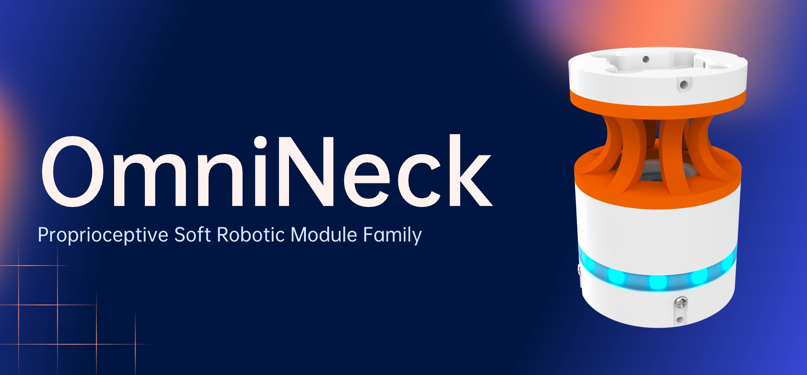

<h1 align="center">Omni-Neck</h1>

<p align="center">
  <a href="https://www.python.org/"></a>
  <a href="https://pytorch.org/"></a>
  <a href="https://www.3ds.com/products/simulia/abaqus/"></a>
  <a href="https://opencv.org/"></a>
  <a href="LICENSE"></a>
  <br/>
  <a href="./docs/training.ipynb">⚡Training Guide</a> |
  <a href="https://sites.google.com/view/prosoro-hardware">🤖Assembly Guide</a> |
  <a href="https://github.com/han-xudong/omnineck-viewer">🫧Data Viewer</a>
</p>
<p align="center">
  
</p>

Omni-Neck is a soft robotic module that mimics the flexibility and dexterity of biological necks. It is designed to provide a wide range of motion and sensing capabilities, making it suitable for various applications in robotics, including manipulation, exploration, and human-robot interaction. Omni-Neck is part of the [Proprioceptive Soft Robot (ProSoRo)](https://prosoro.github.io) family.

## 📦 Installation

Clone this repository:

```bash
git clone https://github.com/han-xudong/omnineck.git
cd omnineck
```

We use `uv` to manage Python dependencies. See [uv documentation](https://docs.astral.sh/uv/getting-started/installation/) for installation instructions. Once `uv` is installed, run the following command to set up the environment:

```bash
uv sync
uv pip install -e .
```

## ⚡ Training

Before training the model, you need to prepare the dataset according to the [training guide](./docs/training.ipynb).

Then, run the following command to train the model:

```bash
uv run python scripts/train.py <options>
```

There are several configurable options for training:

| Options                | Description                                      | Type  | Default             |
| ---------------------- | ------------------------------------------------ | ----- | ------------------- |
| --batch-size           | Batch size for training.                         | int   | 128                 |
| --lr                   | Learning rate for the optimizer.                 | float | 1e-5                |
| --max-epochs           | Maximum number of training epochs.               | int   | 2000                |
| --save-dir             | Directory to save training logs and checkpoints. | str   | lightning_logs      |
| --data.dataset-path    | Path to the dataset directory.                   | str   | ./data/omnineck/sim |
| --data.num-workers     | Number of workers for data loading.              | int   | 4                   |
| --data.pin-memory      | Whether to pin memory during data loading.       | bool  | False               |
| --data.train-val-split | Train-validation split ratios.                   | tuple | 0.875 0.125         |
| --model.name           | Model name                                       | str   | NeckNet             |
| --model.x-dim          | Input dimension                                  | tuple | 6                   |
| --model.y-dim          | Output dimension                                 | tuple | 6 1800              |
| --model.h1-dim         | Hidden layer 1 dimension                         | tuple | 128 1024            |
| --model.h2-dim         | Hidden layer 2 dimension                         | tuple | 128 1024            |

## 🤖 Hardware

The hardware mainly consists of a camera, a soft struture and several 3D-printed parts. The camera is used for capturing images, while the controller board publishes the images through TCP protocol. The soft struture is made of polyurethane (PU). 3D-printed parts are used to assemble the camera, controller board, and power board together.

<p align="center">
  
</p>

But it's not necessary to have the hardware if you just want to run the code. It's available to train and test in the simulation environment.

## 🚀 Deployment

After connecting the Omni-Neck to the computer and modifying the configuration, you can deploy it by running the following command:

```bash
uv run python scripts/deploy.py
```

Various configuration options are available:

| Options       | Description                                 | Type | Default                          |
| ------------- | ------------------------------------------- | ---- | -------------------------------- |
| --host        | Host address for the publisher.             | str  | 127.0.0.1                        |
| --port        | Port number for the publisher.              | int  | 6666                             |
| --camera-yaml | Path to the camera configuration YAML file. | str  | ./configs/camera/camera_001.yaml |
| --onnx-path   | Path to the ONNX model file.                | str  | ./models/NeckNet.onnx            |

All data can be visualized through the [OmniNeck Viewer](https://github.com/han-xudong/omnineck-viewer).

## 📄 License

This repository is released under the [MIT License](LICENSE).
